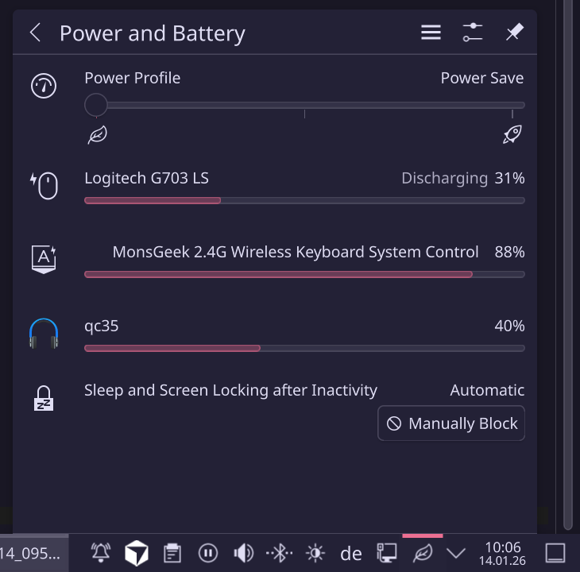

# MonsGeek/Akko Linux Driver
[tui-demo.webm](https://github.com/user-attachments/assets/3eeb464e-2593-4b6a-abe0-6e11d946288a)

[](https://github.com/echtzeit-solutions/monsgeek-akko-linux/actions/workflows/ci.yml)

A Linux userspace driver for MonsGeek, Akko, and other magnetic keyboards using RongYuan firmware (RY5088/YC3121 chipsets). Provides full configuration support via CLI, TUI, and gRPC server compatible with the official web configurator.

## Supported Devices

- MonsGeek M1 V5 HE (Wired) - VID:3151 PID:5030
- MonsGeek M1 V5 HE (Wireless/2.4GHz) - VID:3151 PID:503A
- Akko MOD007B-HE and other Akko HE keyboards (same protocol)

## Features

- **Full keyboard configuration** - LED modes, brightness, speed, colors
- **Per-key settings** - Actuation points, Rapid Trigger, DKS, Snap-Tap
- **Real-time key depth monitoring** - Visualize analog key travel
- **Audio reactive lighting** - Built-in frequency analyzer
- **Screen color sync** - Ambient lighting from screen content
- **GIF animations** - Upload or stream animations to keyboard
- **Key remapping and macros** - Remap keys, record text macros
- **gRPC server** - Compatible with official MonsGeek web app

## Installation

### Prerequisites

**Rust Toolchain** (if not already installed):
```bash
curl --proto '=https' --tlsv1.2 -sSf https://sh.rustup.rs | sh
```

### Host Dependencies

<details>
<summary><b>Debian/Ubuntu</b></summary>

```bash
# Core dependencies (required)
sudo apt install build-essential pkg-config libudev-dev libhidapi-dev protobuf-compiler

# Audio reactive mode (required for audio features)
sudo apt install libasound2-dev

# Optional: JACK audio support
sudo apt install libjack-jackd2-dev

# Optional: Screen capture/sync (PipeWire)
sudo apt install libpipewire-0.3-dev libclang-dev
```
</details>

<details>
<summary><b>Arch Linux</b></summary>

```bash
# Core dependencies (required)
sudo pacman -S base-devel pkgconf hidapi protobuf

# Audio reactive mode (required for audio features)
sudo pacman -S alsa-lib

# Optional: JACK audio support
sudo pacman -S jack2

# Optional: Screen capture/sync (PipeWire)
sudo pacman -S pipewire clang
```
</details>

<details>
<summary><b>Fedora / RHEL / CentOS</b></summary>

```bash
# Core dependencies (required)
sudo dnf install gcc make pkgconf-pkg-config systemd-devel hidapi-devel protobuf-compiler

# Audio reactive mode (required for audio features)
sudo dnf install alsa-lib-devel

# Optional: JACK audio support
sudo dnf install jack-audio-connection-kit-devel

# Optional: Screen capture/sync (PipeWire)
sudo dnf install pipewire-devel clang-devel
```
</details>

<details>
<summary><b>openSUSE</b></summary>

```bash
# Core dependencies (required)
sudo zypper install gcc make pkg-config systemd-devel hidapi-devel protobuf-devel

# Audio reactive mode (required for audio features)
sudo zypper install alsa-devel

# Optional: JACK audio support
sudo zypper install libjack-devel

# Optional: Screen capture/sync (PipeWire)
sudo zypper install pipewire-devel clang-devel
```
</details>

### Build and Install

```bash
git clone https://github.com/echtzeit-solutions/monsgeek-akko-linux.git
cd monsgeek-akko-linux

# Build and install driver + udev rules
make driver
sudo make install
```

Then unplug and replug your keyboard.

Run `make help` to see all available targets:

```
Build targets (run as regular user):
  driver       Build driver release binary (default)
  driver-debug Build driver debug binary
  bpf          Build BPF loader
  bpf-ebpf     Build BPF eBPF program (requires nightly)
  test         Run tests
  check        Run clippy lints
  fmt          Format code
  clean        Clean all build artifacts

Install targets (run with sudo, after building):
  install         Install driver + udev rules
  install-all     Install everything (driver + BPF + systemd)
  install-driver  Install driver binary only
  install-udev    Install udev rules only
  install-bpf     Install BPF loader
  install-systemd Install systemd service for BPF auto-load
  uninstall       Remove all installed files
```

**Optional Cargo features:**

| Feature | Description | Extra Dependencies |
|---------|-------------|-------------------|
| `firmware-api` | Download firmware from cloud (default) | None |
| `screen-capture` | Screen color sync via PipeWire | `pipewire`, `clang` |

To build with optional features:
```bash
cd iot_driver_linux
cargo build --release --features "firmware-api,screen-capture"
```

### HID-BPF Battery Support (Kernel 6.12+)

The `akko-loader` BPF program exposes wireless keyboard battery level to the Linux power subsystem. **Requires kernel 6.12 or newer** due to HID-BPF struct_ops verifier requirements.



**Prerequisites:**

```bash
# Check kernel version (must be 6.12+)
uname -r

# Install nightly Rust and bpf-linker (one-time setup)
rustup install nightly
cargo install bpf-linker
```

**Build and install:**

```bash
# Build driver and BPF loader first (as regular user)
make driver
make bpf

# Install driver, BPF loader, and systemd service (as root)
sudo make install-all

# Or install BPF components separately:
sudo make install-bpf      # Install akko-loader + BPF program
sudo make install-systemd  # Install systemd service for auto-load
```

**Manual usage:**

```bash
# Check status
akko-loader

# Load BPF (requires root)
sudo akko-loader load

# Check battery
cat /sys/class/power_supply/hid-*/capacity

# Unload BPF
sudo akko-loader unload
```

The BPF program pins to `/sys/fs/bpf/akko` and persists until unloaded.

**Known limitations:**

- **Charging status not available**: The keyboard's HID protocol does not expose charging status to the host. The power supply will always show "Discharging" regardless of whether the keyboard is plugged in. The firmware has charging detection internally (for the LED indicator) but this information is not sent via USB. Only battery percentage is available.

**Automatic loading with udev/systemd:**

For automatic battery support when the keyboard connects, install the systemd service (included in `make install-all` or separately via `make install-systemd`).

How it works:
- When the keyboard connects, udev detects the device (VID:3151 PID:5038)
- udev triggers `akko-bpf-battery.service` via `SYSTEMD_WANTS`
- The service runs `akko-loader load` to attach the BPF program
- Battery level appears in `/sys/class/power_supply/` and desktop battery monitors
- When the keyboard disconnects, udev stops the service which runs `akko-loader unload`

Check service status:
```bash
systemctl status akko-bpf-battery.service
```

## Usage

### CLI Commands

```bash
# Device information
iot_driver info              # Device ID and firmware version
iot_driver all               # All device settings
iot_driver features          # Supported features and precision

# LED control
iot_driver led               # Current LED settings
iot_driver mode wave         # Set LED mode by name
iot_driver mode 4            # Set LED mode by number
iot_driver modes             # List all LED modes
iot_driver set-led 1 4 2 255 0 128  # mode brightness speed R G B

# Per-key settings
iot_driver triggers          # Show trigger settings
iot_driver set-actuation 2.0 # Set actuation point (mm)
iot_driver set-rt on 0.3     # Enable Rapid Trigger with sensitivity
iot_driver set-rt off        # Disable Rapid Trigger

# Polling rate
iot_driver rate              # Get current polling rate
iot_driver set-rate 8000     # Set to 8kHz (8000, 4000, 2000, 1000, 500, 250, 125)

# Key remapping
iot_driver remap A B         # Remap A key to output B
iot_driver swap A S          # Swap two keys
iot_driver reset-key A       # Reset key to default

# Macros
iot_driver set-macro F1 "Hello World"  # Set text macro
iot_driver macro F1                     # Show macro
iot_driver clear-macro F1               # Clear macro

# Animations
iot_driver gif image.gif     # Upload GIF to keyboard memory
iot_driver gif-stream a.gif  # Stream GIF in real-time
iot_driver rainbow           # Real-time rainbow animation
iot_driver wave              # Wave animation demo

# Audio reactive
iot_driver audio             # Run audio reactive mode
iot_driver audio-test        # List audio devices
iot_driver audio-levels      # Show audio levels

# Screen sync
iot_driver screen            # Sync keyboard to screen colors

# Key depth monitoring
iot_driver depth             # Real-time key depth display
iot_driver depth --raw       # Raw depth values
```

### Interactive TUI

Launch the terminal user interface for interactive control:

```bash
iot_driver tui
```

<video src="iot_driver_linux/tui-demo.webm" controls width="100%"></video>

**TUI Features:**
- Tab navigation between Device Info, LED Settings, Key Depth, Triggers, Options, Macros
- Real-time key depth visualization (bar chart and time series)
- Visual keyboard layout for per-key trigger settings
- Arrow keys to adjust values, Enter to confirm

**Key Depth Tab:**
- `v` - Toggle between bar chart and time series view
- `Space` - Select key for time series tracking
- `x` - Clear depth history

**Triggers Tab:**
- `v` - Toggle between list and keyboard layout view
- Arrow keys - Navigate keys in layout view
- `n/t/d/s` - Set mode (Normal/RT/DKS/SnapTap) for selected key
- `N/T/D/S` - Set mode for ALL keys

### Web App (app.monsgeek.com)

The driver includes a gRPC server that's compatible with the official MonsGeek web configurator.

**Start the server:**
```bash
iot_driver serve
```

The server runs on `127.0.0.1:3814` with gRPC-Web support.

**Connect from web app:**

1. Start the driver server: `iot_driver serve`
2. Open https://app.monsgeek.com in your browser
3. The web app will detect and connect to your keyboard
4. Use the full web UI for configuration

**Note:** The web app expects the server at localhost:3814. All keyboard features are accessible through the web interface including:
- LED mode selection and color picker
- Per-key RGB customization
- Trigger/actuation settings
- Key remapping
- Macro editor
- Firmware updates (use with caution)

## LED Modes

| # | Mode | Description |
|---|------|-------------|
| 0 | Off | LEDs disabled |
| 1 | Constant | Static color |
| 2 | Breathing | Pulsing effect |
| 3 | Neon | Neon glow |
| 4 | Wave | Color wave |
| 5 | Ripple | Ripple from keypress |
| 6 | Raindrop | Raindrops |
| 7 | Snake | Snake pattern |
| 8 | Reactive | React to keypress (stay lit) |
| 9 | Converge | Converging pattern |
| 10 | Sine Wave | Sine wave |
| 11 | Kaleidoscope | Kaleidoscope |
| 12 | Line Wave | Line wave |
| 13 | User Picture | Custom per-key (4 layers) |
| 14 | Laser | Laser effect |
| 15 | Circle Wave | Circular wave |
| 16 | Rainbow | Rainbow/dazzle |
| 17 | Rain Down | Rain downward |
| 18 | Meteor | Meteor shower |
| 19 | Reactive Off | React briefly |
| 20 | Music Patterns | Audio reactive patterns |
| 21 | Screen Sync | Ambient screen color |
| 22 | Music Bars | Audio reactive bars |
| 23 | Train | Train pattern |
| 24 | Fireworks | Fireworks |
| 25 | Per-Key Color | Dynamic animation (GIF) |

## Per-Key Modes

| Mode | Description |
|------|-------------|
| Normal | Standard actuation/release points |
| Rapid Trigger (RT) | Dynamic actuation based on movement |
| DKS | Dynamic Keystroke (4-stage trigger) |
| Mod-Tap | Different action for tap vs hold |
| Toggle Hold | Toggle on hold |
| Toggle Dots | Toggle on double-tap |
| Snap-Tap | SOCD resolution (bind to another key) |

## Troubleshooting

### Permission Denied
Make sure udev rules are installed and you've re-plugged the keyboard.

### Device Not Found
```bash
iot_driver list  # Check if device is visible
lsusb | grep 3151  # Verify USB connection
```

### TUI Not Starting
The TUI requires a proper terminal. It won't work in background mode or without a TTY.

### Web App Not Connecting
1. Ensure server is running: `iot_driver serve`
2. Check firewall isn't blocking port 3814
3. Verify with: `curl -v http://127.0.0.1:3814`

## Protocol Documentation

See [docs/PROTOCOL.md](docs/PROTOCOL.md) for the complete HID protocol specification, including:

- Transport layer details (USB wired, 2.4GHz dongle, Bluetooth LE)
- Message format and checksum algorithms
- Complete command reference (SET/GET commands)
- Data structures (LED params, trigger settings, key matrix)
- Event notifications and key depth monitoring
- Device database (VID/PID table)

## License

This project is licensed under the **GNU General Public License v3.0** - see the [LICENSE](LICENSE) file for details.

This means you're free to use, modify, and distribute this software, but any modifications must also be released under GPL-3.0.

## Acknowledgments

- Protocol reverse-engineered from the official MonsGeek Windows driver
- Inspired by the need for Linux support for HE keyboards
